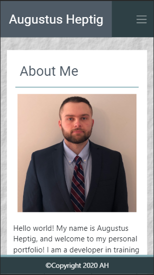
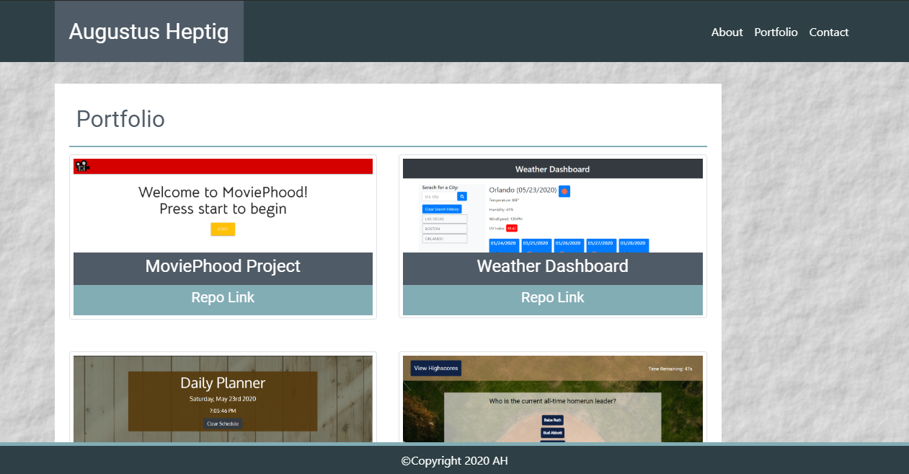
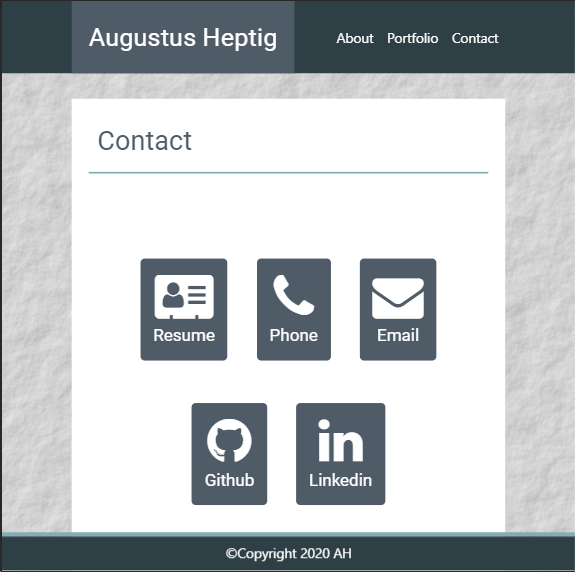

## Welcome to My Portfolio

## Description
This a comprehensive responsive website that gives a brief inrtoduction to who I am, past/current experiences, links to GitHub profile/projects, and other ways to get in contact with me.

Any and all feedback is welcomed and appreciated.  

### URL
https://gheptig.github.io/portfolio/

### Technical Features

* [HMTL](https://developer.mozilla.org/en-US/docs/Web/HTML) - Gives application it's structure and DOM elements.

* [CSS](https://developer.mozilla.org/en-US/docs/Web/CSS) - Used to style the html elements/application.

* [Bootstrap](https://getbootstrap.com/docs/4.4/getting-started/introduction/) - Grid/Column system used to create page layout/structure.  Also used to create and style elements such as buttons, navbar, and modal.

* [JavaScript](https://developer.mozilla.org/en-US/docs/Web/JavaScript) - Used to dynamically display modal elements on html and get website to function/operate.

* [jQuery](https://jquery.com/) -  Used to simplify JavaScript code and DOM traversal.

## Preview Screenshots

### About Me

### Portfolio

### Contact

## Contributers/Authors

Augustus Heptig

